# Event loop

# Gemini generated informations

## The Event Loop: A Detailed Explanation

At its core, JavaScript is a single-threaded language. This means it has only one Call Stack and can only do one thing at a time. If it's busy executing a long task (e.g., a complex calculation or a network request), the entire user interface freezes. You can't click, scroll, or type.

The Event Loop is JavaScript's solution to this problem. It allows JavaScript to perform long-running tasks without blocking the main thread by offloading them to the browser's APIs and handling their results when they're ready.

## Here are the key players and how they work together:

1. The Call Stack (The "Executive Chef")

- Role: To execute code. It's a LIFO (Last-In, First-Out) structure.

- How it works: When a function is called, it's pushed onto the top of the stack. When the function finishes (returns), it's popped off the stack. All of your synchronous code runs here.

- Analogy: Imagine a chef in a kitchen who can only cook one dish at a time. The current dish they are working on is at the top of their "to-do" stack.

2. Web APIs (The "Kitchen Crew")

- Role: To handle tasks that take time. This is not part of the JavaScript engine itself; it's provided by the browser (or Node.js environment).

- How it works: When the Call Stack encounters an asynchronous function like setTimeout(), a fetch() request, or a DOM event listener, it doesn't wait. It hands the task over to the Web APIs and immediately moves on to the next line of code. The Web API runs the timer or makes the network request in the background. Once it's finished, it pushes the associated callback function into one of the queues.

- Analogy: The executive chef (Call Stack) gets an order for a slow-cooked stew (setTimeout). Instead of cooking it themselves and stopping all other work, they give the recipe to a kitchen crew member (Web API) and immediately start the next quick dish.

3. The Callback Queue (or Task Queue)

- Role: A waiting area for completed tasks from "older" Web APIs.

- How it works: When a setTimeout timer finishes or a user clicks a button, the associated callback function is placed in this queue. It's a FIFO (First-In, First-Out) structure.

- Analogy: This is the standard line of completed dishes waiting to be served.

4. The Microtask Queue (The "VIP Line")

- Role: A special, high-priority waiting area.

- How it works: This queue is specifically for the results of Promises (.then(), .catch(), .finally()) and some other modern async tasks (async/await).

- Key Rule: The Event Loop will always process every single task in the Microtask Queue before it considers processing even one task from the Callback Queue. It has higher priority.

- Analogy: This is the VIP express line for special orders. The chef will always serve everyone in this line before serving anyone from the standard line.

5. The Event Loop (The "Orchestrator")
   Role: To constantly monitor the Call Stack and the Queues.

- Its One Simple Job: "Is the Call Stack empty?"

- If NO, it does nothing.

- If YES, it checks the queues.

- It first checks the Microtask Queue. If there's anything there, it pushes the first task onto the Call Stack to be executed. It repeats this until the Microtask Queue is completely empty.

- Only when the Microtask Queue is empty does it check the Callback Queue. If there's something there, it pushes the first task onto the Call Stack.

## Resources for the Event Loop

🎥 Best YouTube Videos (Must-Watch)

- What the heck is the event loop anyway? by Philip Roberts

Why it's the best: This is the classic, definitive explanation. Philip uses fantastic visualizations and a clear, simple analogy to make the concept click. He also introduces the interactive tool Loupe. If you watch only one video, make it this one.

In The Loop - Jake Archibald

Why it's great: This is a more advanced and technically deep dive. Jake Archibald goes into detail about how rendering fits into the Event Loop, showing how even a resolved Promise can run before the page updates. It's the perfect "next step" after watching Philip Roberts' talk.

- 📖 "You Don't Know JS Yet" (Async & Performance)
  The book series covers this in the "Async & Performance" volume, specifically in Chapter 1: Asynchrony: Now & Later and Chapter 2: Callbacks.

Key Takeaway from YDKJS: Kyle Simpson emphasizes that asynchrony is about the gap between now (when a command is executed) and later (when its result is ready). He brilliantly explains that setTimeout(myCallback, 0) doesn't mean "run this callback in 0 milliseconds." It means, "add myCallback to the Callback Queue as soon as possible." The Event Loop will only pick it up when the Call Stack is clear.

- 🛠️ Interactive Tool
  Loupe by LatentFlip: This is the interactive visualizer used in Philip Roberts' talk. You can paste your own code and watch how the stack, queues, and APIs interact. It's an invaluable tool for testing your understanding.

## Answers to Common Event Loop Interview Questions

- Q1: "Can you explain the Event Loop?"
  Your Perfect Answer:
  "JavaScript is single-threaded, meaning it has only one call stack and can do one thing at a time. The Event Loop is the mechanism that allows it to perform non-blocking asynchronous operations.

When an async task like setTimeout or a fetch request is called, it's handed off to a Web API in the browser. The JavaScript code continues to run without waiting. Once the Web API finishes its task, it pushes the associated callback function into either the Callback Queue or, in the case of a Promise, the Microtask Queue.

The Event Loop's job is to constantly check if the Call Stack is empty. If it is, it will first process all tasks from the high-priority Microtask Queue until it's empty. Only then will it take the first task from the Callback Queue and push it onto the Call Stack for execution. This cycle allows JavaScript to remain responsive while handling long-running tasks."

- Q2: "What is the difference between the Microtask Queue and the Callback Queue?"
  Your Perfect Answer:
  "The main difference is priority. The Event Loop will always give priority to the Microtask Queue. After every synchronous task finishes and the call stack is empty, the event loop will execute all tasks currently in the Microtask Queue before executing a single task from the Callback Queue. This means a callback from a Promise (.then or .catch) will always run before a callback from a setTimeout, even if both were ready at the same time."

- Q3: "What will be the order of logs for the following code?"

```javascript
console.log("1: Start");

setTimeout(() => {
  console.log("2: setTimeout Callback");
}, 0);

Promise.resolve().then(() => {
  console.log("3: Promise Microtask");
});

console.log("4: End");
```

Your Perfect Answer and Explanation:
"The output will be:
1: Start
4: End
3: Promise Microtask
2: setTimeout Callback

Here's why:

1. '1: Start' is a synchronous task, so it's pushed to the Call Stack and logged immediately.

2. setTimeout is handed to the Web API. Its callback '2: setTimeout Callback' is placed in the Callback Queue after 0ms.

3. Promise.resolve().then() is also async. Its callback '3: Promise Microtask' is immediately placed in the Microtask Queue.

4. '4: End' is synchronous, so it's logged right away.

5. Now the synchronous code is done, and the Call Stack is empty. The Event Loop checks the queues.

6. It sees the Microtask Queue has a task, so it pushes '3: Promise Microtask' to the stack and logs it.

7. The stack is empty again. The Microtask Queue is now empty. The Event Loop checks the Callback Queue, finds '2: setTimeout Callback', pushes it to the stack, and logs it."

## Notes from youtube by Lydia Hallie

The Event loop pretty notorious topic in JS. But when we zoom out it's just a tiny component within javascript runtime.

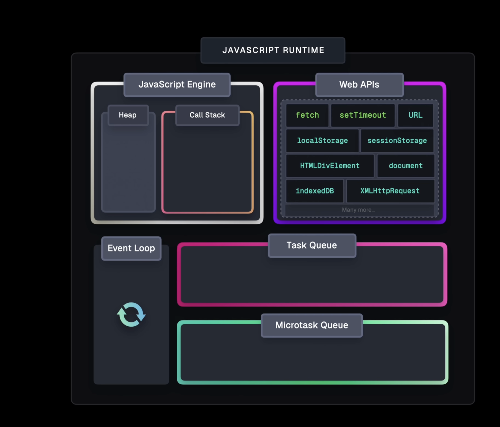

All these components together allow us to use asynchronous tasks in a non-blocking way in js, and this is important because js itself is single threaded we're working with a single call stack so the call stack manages the execution of our program.

Here new execution context created pushed onto the call stack which is then evaluated and logs one
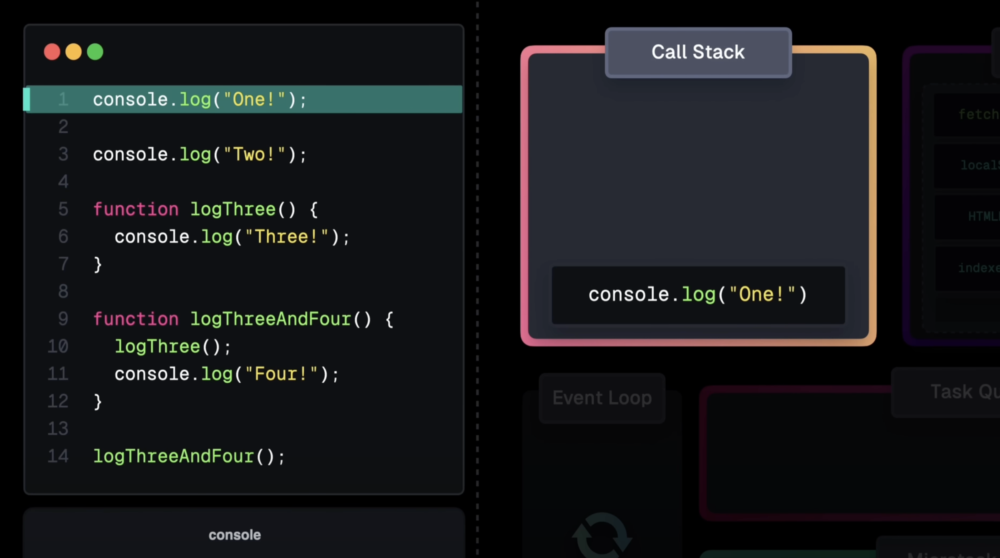

Then on line 14 we invoke another function logThreeAndFour and within this function body we invoke yet another function logThree and within logThree we invoke another function log the console log three
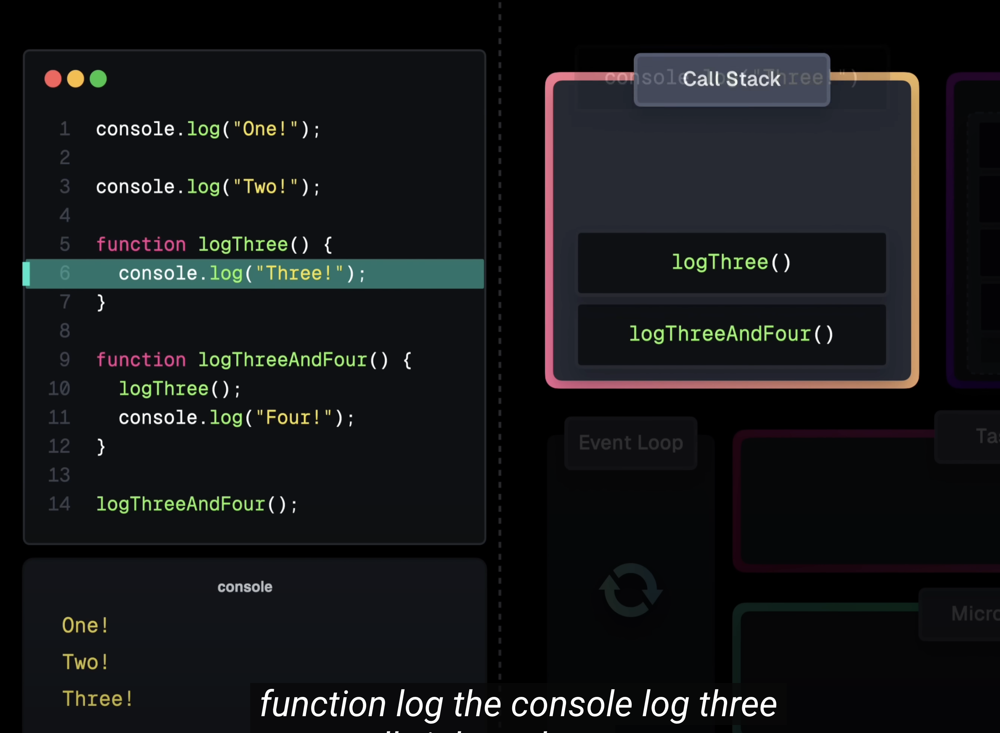

Something important to remember here again is that js can handle task at a time so if we had this long running task in which we have pretty heavy computation it takes while before for js can continue with rest of our program so the console log long task done is only logged after a couple seconds and this is not we want, because in the meantime our entire program is frozen so we want to avoid these long running tasks
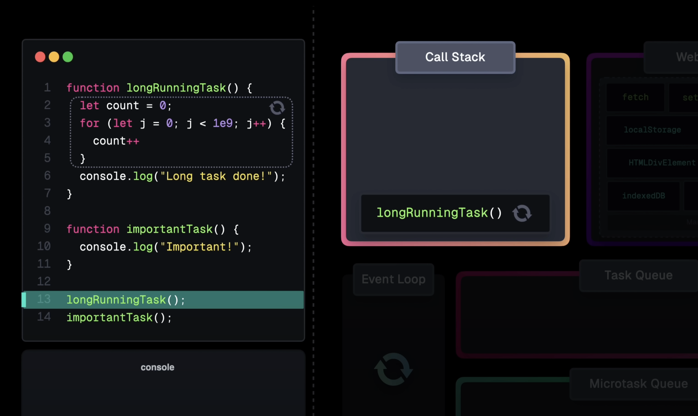

We have to use long running tasks like maybe a network request or anything based on user input, timers so what happens then, is our entire call stack blocked untill we get the data back. No because we're actually using Web APIs in those cases and what web apis provide set of interfaces that allow us to interact with the browser's features this includes fetch and others
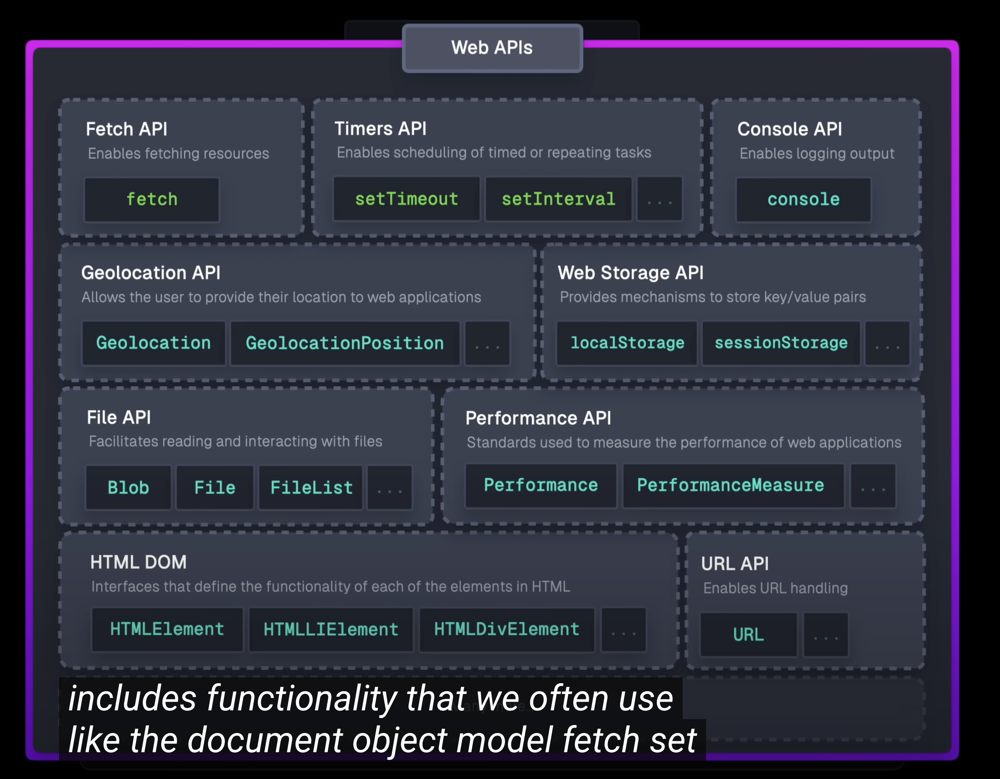

Browser is a very powerful platform with a lot of features, some of these features are required like you rendering engine or networking stack. Some of the web apis allow us to offload long running tasks to the browser so when we invoke such an API we're kind of just initiating that offloading and web apis that expose these asynchronous capabilities are either callback based or promise based
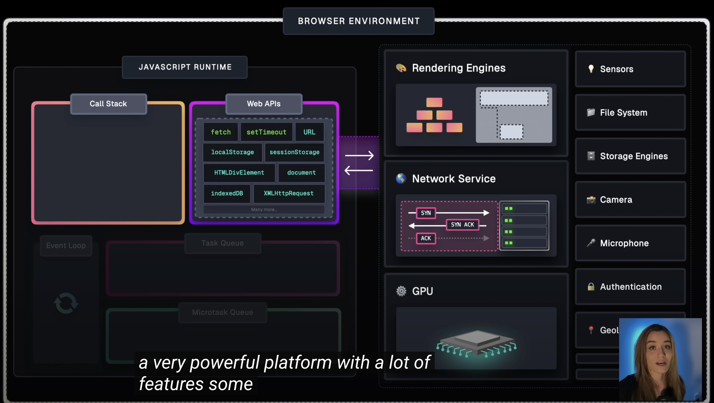
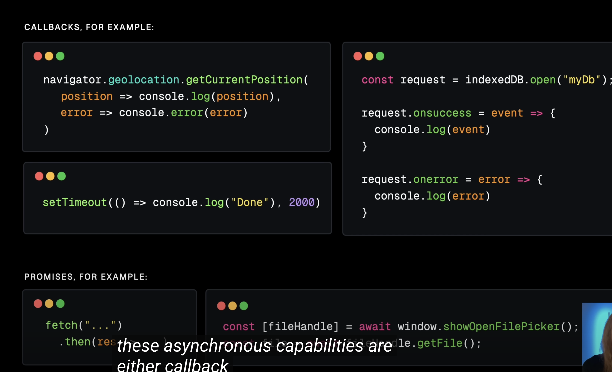

So here we are looking callback based,so what happens here when we actually use this in our script so first the getCurrentPostion invocation gets added to the call stack
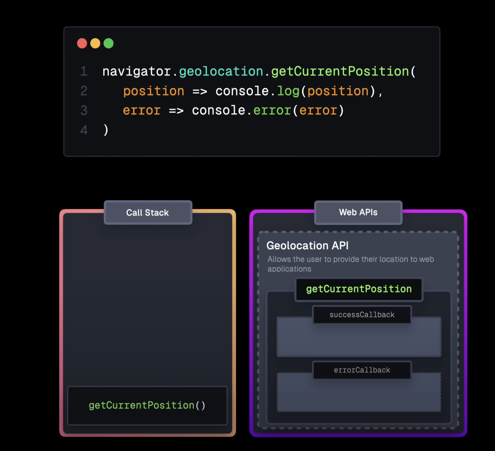

However this is just to register those call backs and initiate that async task after doing that it can get popped off the call stack immediately so it doesn't wait for any data, now in the background the browser starts some kind of process that eventually shows the user popup
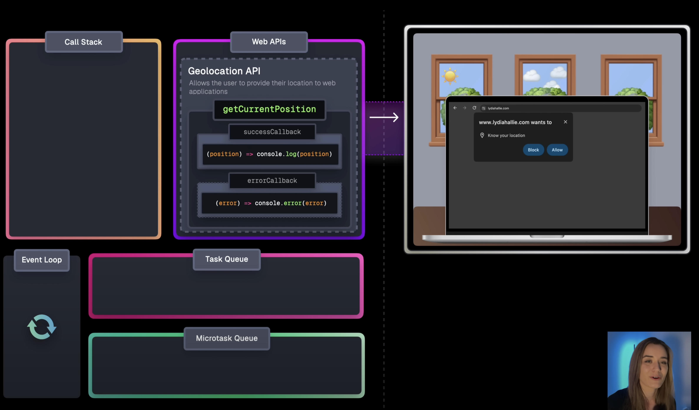

This is not a problem because this is not happening on the call stack so our entire website is still responsive in case other tasks need to run instead. When user clicks on allow, API receives data from browser, and used success call back to handle this result. However it can't just push that call back to back on the call stack, this could disrupt an already running task and just create very unpredictable behavior. So instead callback gets pushed to the task queue which is also called callback queue for this exact reason.
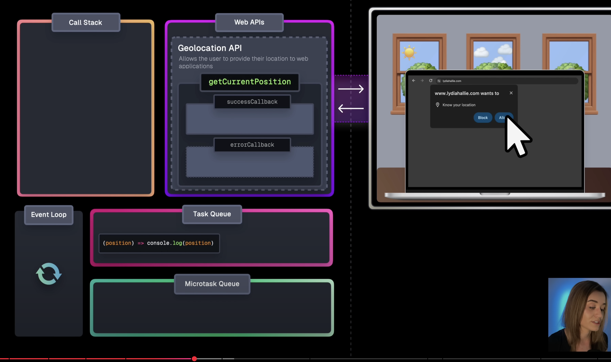

The task queue holds Web API callbacks and event handlers to be able to get executed at some point later in the future and this is what we finnally get to the event loop, it's event loop's responsibility to check if the call stack is empty and if that's the case so if nothing is running and then gets first available task from task queue and moves this to the call stack where it's executed

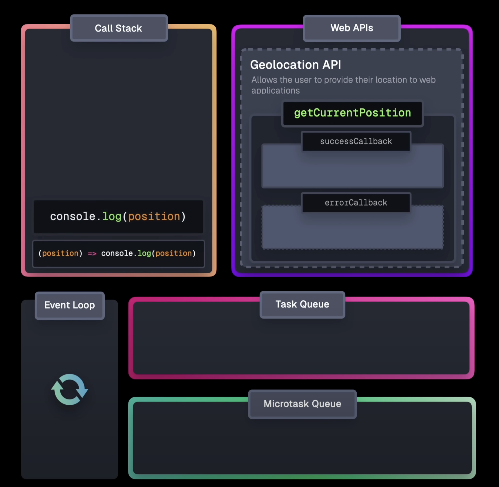

Another very popular callback based Web API is setTimeout and setTimout also receives a callback and a delay. So let's see how that works, so first we encounter a setTimout and this again gets added to the call stack but all it does again a register that callback and also to delay with the timer's API and in the background the browser will handle that timer then we have another setTimeout and again it registers the callback and the delay, after 100 ms the browser is like hey 100 ms expired so now callback moves onto the task queue, nothing on the call stack right now so this moves onto the call stack. It just very important to remembar that when you have a setTimeout and delay, it's not the delay untill it gets moved onto the call stack, no it's the delay untill it gets moved to the task queue, so this means that the delay we specify might not actually be the delay to execution because if the call stack was still very full with other tasks and this could run for many more seconds, the callback still have to wait in the task queue untill call stack is empty.
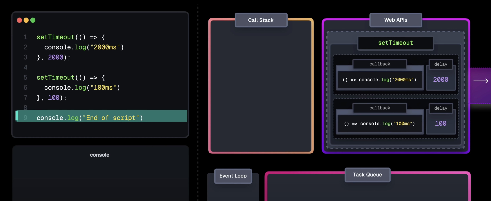

Whenever we work with promises we're working with the MicroTask queue. The microtask queue is a special queue dedicated to then, catch finally call backs, a function body execution after await the queue microtask callback and new mutation observer callback so only those callbacks or those function body parts get pushed on microtask queue, so it's very specific
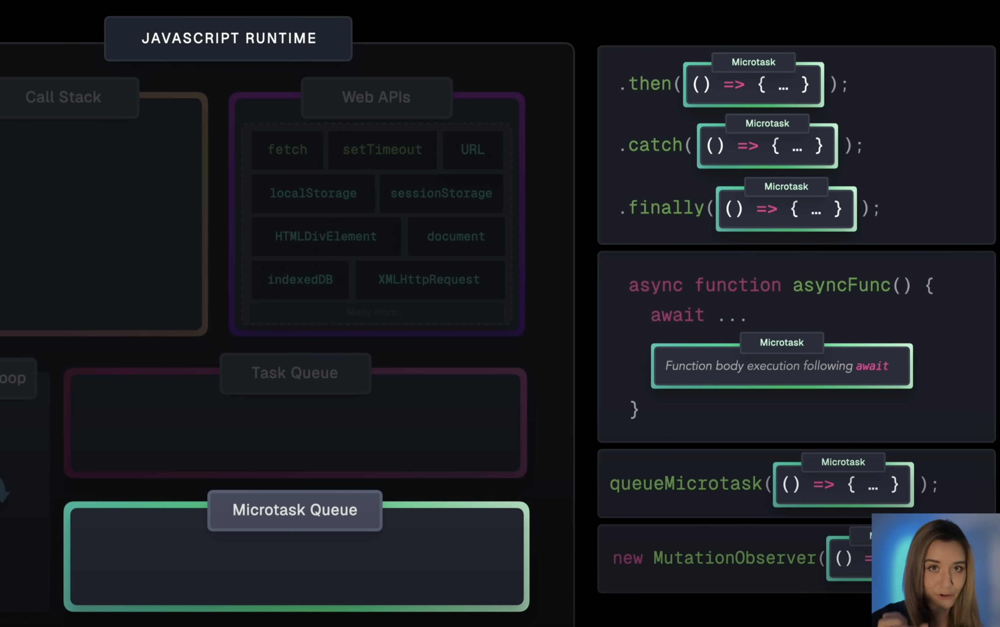

Event loop prioritizes microtask queue over task queue. Whenever call stack is empty, event loop first ensures that microtask queue is entirely empty, so it gets all the tasks from the microtask queue moves them onto the call stack where they get executed and only then it will move to the task queue

There is something important to keep in mind with microtasks is that a microtask can schedule another microtask and this means the event loop is just constantly handling the microtask and it never actually get to the task queue, it would just have to wait indefinetely so we're kind of creating an infinite loop, an infinite microstask loop freezing our entire program
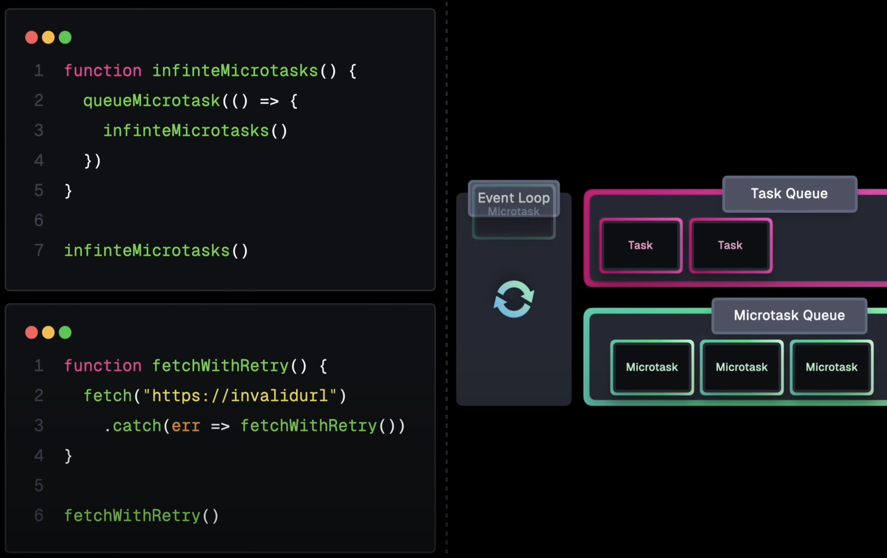

Let's just recap we've covered so far, so js is single threaded it can only handle one task at a time, we can use web apis to interact with the features leveraged by the browser, and some of these apis allow us to initiate async tasks in the background, so function call that initiates an async task like that is still added to the call stack but this is just hand it off to the browser. The actual async task is handled in the background, so it does not block the call stack, the task queue used by callback based apis to enue the callback once asynchrounous task has completed. Then we have microtask queue which is only used by promise handlers, the async function bodies after await microtask queue callbacks and new MutationObserver callbacks. Thsi queue has priority over the task queue. The event loop ensures that this queue is entirely empty before moving on task queue. And after handling each task from the task queue, the event loop checks the microtask queue to ensure that nothing has been added in the mean time.
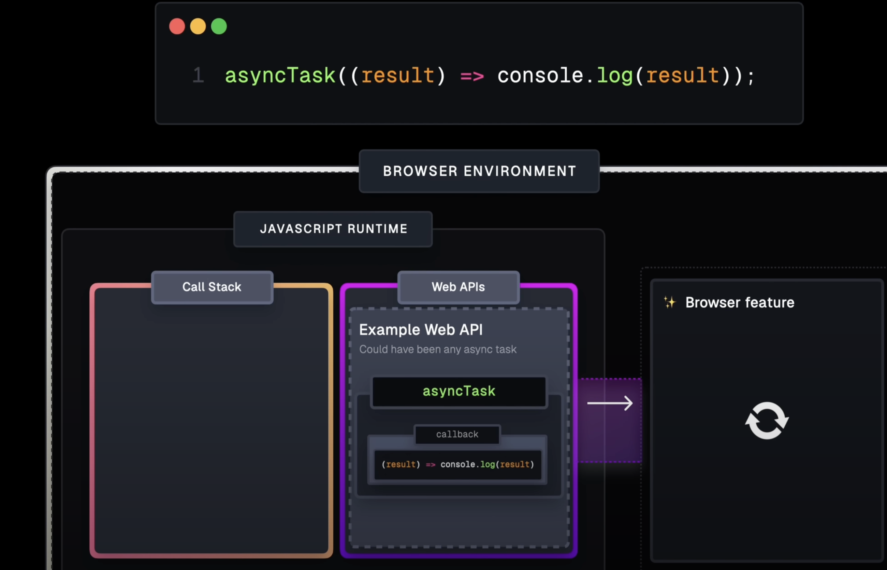

## Recources

- **JavaScript Visualized - Event Loop,** Web APIs, (Micro)task Queue by Lydia Hallie https://www.youtube.com/watch?v=eiC58R16hb8&t=26s
- **"Syncing Async" (OSCON 2014)** by Kyle Simpson

## New words
