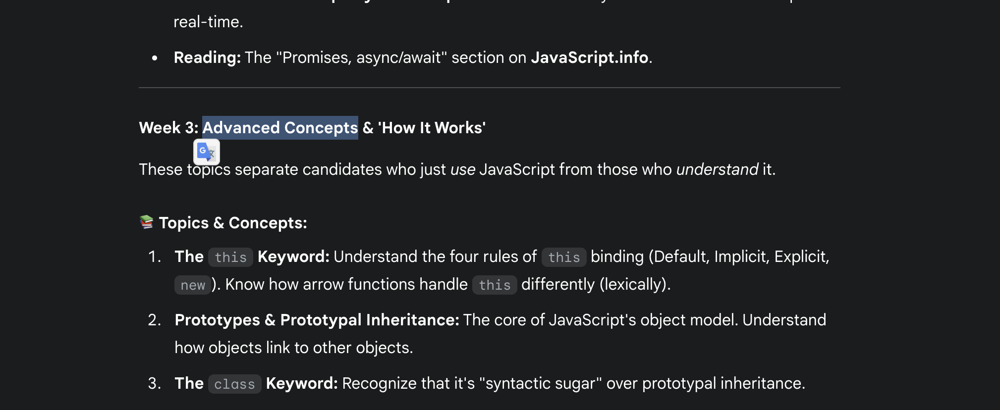

# Event loop

## Definition

A closure is when a function "remembers" the variables from the environment in which it was created, even after that environment has been closed. In simple terms, an inner function has access to the variables of its outer function.

## Code Example

```javascript
function createCounter() {
  let count = 0; // This variable is "closed over" by the inner function

  return function () {
    count++; // The inner function can access and modify 'count'
    console.log(count);
  };
}

const counter = createCounter(); // createCounter() has finished executing

counter(); // logs 1
counter(); // logs 2
counter(); // logs 3
```

## Key Points & Use Cases

- **Data Encapsulation / Private Variables:** Closures are the primary way to create private data in JavaScript, preventing outside code from directly manipulating your variables.
- **Event Handlers & Callbacks:** Commonly used in event listeners (like in React's `useEffect`) to maintain state.
- **Currying & Function Factories:** Useful for creating specialized functions.



## Recources

- \*\*JavaScript Visualized - Event Loop, Web APIs, (Micro)task Queue by Lydia Hallie
- \*\*"Syncing Async" (OSCON 2014) Kyle Simpson

## New words
