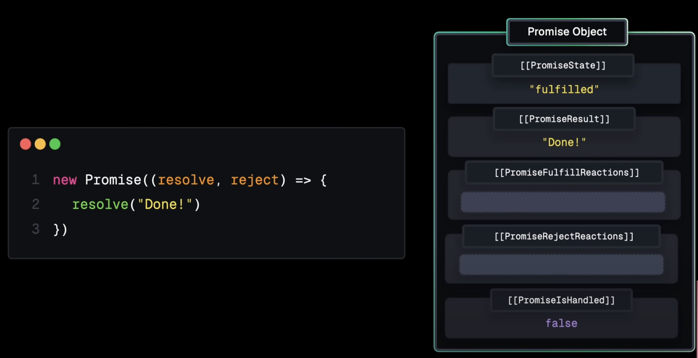

# Promise

## A Promise is a JavaScript object that represents the eventual completion (or failure) of an asynchronous operation. Think of it as a placeholder for a future value.

This guide will give you the deep understanding you need to feel confident answering any Promise-related question in an interview.

## The Core Idea: An Analogy

A Promise works just like ordering a package online.

1. When you place the order, you get a tracking number immediately. This tracking number is the Promise. It doesn't contain your item yet, but it's a guarantee that you'll eventually get something.

2. The initial state is pending. Your order is being processed.

3. If the package arrives successfully, the state becomes fulfilled. You get your item (the data).

4. If the package is lost or damaged, the state becomes rejected. You get an error message.

## The Three States of a Promise

Every Promise is in one of these three states, and it can only move from pending to one of the other two. It can never go back.

- pending: The initial state; the asynchronous operation has not completed yet.

- fulfilled: The operation completed successfully, and the Promise now has a resolved value.

- rejected: The operation failed, and the Promise has a reason for the failure (an error).

## How to Consume a Promise: .then(), .catch(), .finally()

You interact with a Promise by attaching callbacks to it. This is how you "flatten" the Pyramid of Doom.

- .then(onFulfilled, onRejected): This is the primary method. It takes two optional arguments: a function to run if the promise is fulfilled, and a function to run if it's rejected. You'll most often only use the first one.

- .catch(onRejected): This is just syntactic sugar for .then(null, onRejected). It's the standard, readable way to handle any errors that occur in the promise chain.

- .finally(onFinally): This takes a function that will be executed whether the promise is fulfilled or rejected. It's perfect for cleanup tasks, like hiding a loading spinner.

## Code Example: Creating and Using a Promise

```javascript
const willGetNewPhone = new Promise((resolve, reject) => {
  // Simulate an async operation (e.g., checking stock)
  setTimeout(() => {
    const isPhoneInStock = true;

    if (isPhoneInStock) {
      const phone = { brand: "FuturePhone", model: "Pro Max" };
      resolve(phone); // Fulfill the promise with a value
    } else {
      const reason = new Error("Sorry, the phone is out of stock.");
      reject(reason); // Reject the promise with an error
    }
  }, 2000);
});

// Now, let's consume the promise
console.log("Placing my order...");

willGetNewPhone
  .then((phoneDetails) => {
    // This runs only if the promise is fulfilled
    console.log("Success! I got a new phone:", phoneDetails);
  })
  .catch((error) => {
    // This runs only if the promise is rejected
    console.error(error.message);
  })
  .finally(() => {
    // This runs no matter what
    console.log("The transaction is now complete.");
  });
```

Promise Combinators: Promise.all() & Promise.race()
These are powerful tools for managing multiple promises at once.

```javascript
Promise.all(promises);
```

Waits for all promises in an array to be fulfilled, then fulfills with an array of their results. If any single promise rejects, the whole thing rejects immediately.

- Use Case: You need to make multiple API calls to get different pieces of data, and you can only render your UI after you have all of them.

```javascript
const promise1 = fetch("https://api.example.com/user");
const promise2 = fetch("https://api.example.com/posts");

Promise.all([promise1, promise2])
  .then((results) => {
    // results is an array: [userResponse, postsResponse]
    console.log("Got both user and posts!");
  })
  .catch((error) => {
    console.error("One of the fetches failed:", error);
  });
```

```javascript
Promise.race(promises);
```

Waits for the first promise in an array to either fulfill or reject, and it settles with that result. It's a race to the finish line.

- Use Case: You have multiple servers with the same data, and you want to get a response from whichever one is fastest.

```javascript
const promiseA = new Promise((resolve) =>
  setTimeout(() => resolve("A wins!"), 1000)
);
const promiseB = new Promise((resolve) =>
  setTimeout(() => resolve("B wins!"), 2000)
);

Promise.race([promiseA, promiseB]).then((winner) => {
  console.log(winner); // Logs "A wins!" after 1 second
});
```

## 🏆 Interview Questions & Confident Answers

### Q1: "What is a Promise?"

Your Answer: "A Promise is a special JavaScript object that acts as a placeholder for a value that will be available in the future. It represents the eventual result of an asynchronous operation. A Promise can be in one of three states: pending, fulfilled with a value, or rejected with an error. We handle these outcomes using .then() for success, .catch() for failure, and .finally() for cleanup."

### Q2: "How are Promises an improvement over callbacks?"

Your Answer: "Promises solve two main problems with callbacks. First, they solve Callback Hell by allowing us to chain asynchronous operations with .then() in a flat, readable, and sequential way, avoiding deep nesting. Second, they provide a much better, centralized way to handle errors. Instead of needing an error argument in every callback, we can use a single .catch() at the end of the chain to handle any failure that occurs."

### Q3: "What's the difference between Promise.all and Promise.race?"

Your Answer: "Promise.all takes an array of promises and resolves when all of them have successfully resolved, returning an array of their results. It's an 'all or nothing' deal—if any promise fails, the entire Promise.all fails. In contrast, Promise.race also takes an array of promises, but it resolves or rejects as soon as the very first promise in the array resolves or rejects. It's a race to the first result."

### Q4 (Code Challenge): "What will be logged to the console?"

```javascript
console.log("A");

setTimeout(() => console.log("B"), 0);

Promise.resolve().then(() => console.log("C"));

console.log("D");
```

Your Answer: "The output will be A, D, C, B.

- 'A' and 'D' are synchronous, so they log first.
- setTimeout's callback ('B') is placed in the Callback Queue.
- The Promise's .then() callback ('C') is placed in the Microtask Queue.
- The Event Loop always empties the Microtask Queue completely before processing anything from the Callback Queue. Therefore, 'C' logs before 'B'."

## Notes from youtube by Lydia Hallie

One way to create a promise is by using new Promise constructor and this constructor also receives an Executer function. When the promise constructor is executed, a new promise object is created in memory and this object constains some internal slots like the PromiseState, PromiseResult, PromiseFulFillReactions, PromiseRejectReactions and PromiseIsHandled. We also get additional functionality to either resolve or reject this promise.


Now we can resolve this Promise by calling resolve which is made available to us by the executer function and when we call resolve the PromiseState is set to fulfilled and the PromisedResult is set to the value that we pass to resolve so the string done in this case.


Simularly we can reject the Promise by calling reject, in which case the PromiseState is said to rejected and the PromiseResult is set to the value that we passed to reject, so the string "fail".


So nothing special here we're just calling function to change some object property. So what's so spacial about promises. Well that's actually in those two fields that we skipped so far, so in the PromiseFulFillReactions and PromiseRejectReactions. Because these fields contains something called Promise reaction records. We can create a promise reaction record by chaining a **then** or a **catch** method to the promise. So whenever we chain **then**, the then method is responsible for creating that promise reaction record and among many other fields this reaction record contains a handler and this has some code and that code is that callback that we passed to **then**.Now what happens is that whenever we resolve the promise, so we call resolve, resolve is added to the call stack the promise state is set to fulfill the promise result set to the value that we pass to resolve and promise reaction records handler receives that promise result. So string "done" in this case. And the handler is now added to microTask queue


Usually you want to initiate some kind of asynchronous task in this constructor with an asynchronous task, i mean anything off the main thread. So reading something from a file system or a network request or something as simple as a timer. Whenever they return data, we can use their callback function to either resolve with the data that returned or reject if an error occured


Let's see how the execution goes for this promise constructor. So we have promise constructor that has a setTimeout and we also have a **then** handler. Let's just go through it step by step and see what happens. So first a new promise constructor is added to the call stack and this creates the promise object.


The executer function is called and on the first line we have setTimeout, so setTimeout is added to the call stack and this one is responsible for scheduling that timer. In this case 100 milliseconds and it has callback that we passed to the setTimeout so the function that eventually calls resolve.


Then on the next line we have then handler, so then is added to the call stack and this responsible for creating that PromiseReactionRecord, so this creates a PromiseReactionRecord with a callback that we provided as its handler.


After 100 ms finished, the callback that we passed to the setTimeout is now added to the task queue, there is nothing on the call stack anymore, so it can now go from task queue to call stack. And this now calls resolve so this changes PromiseResult to fulfilled, the PromiseReult to string 'done' and it schedules handler to the microtask queue. Event loop does its job, and at the end console.log(result) gets executed on call stack and result is string "Done". So all process means we can handle promise result in non blocking way.


Another cool thing is that **then** itself also returns promise, so besides just creating that PromiseReactionRecord it also creates a promise object and this allow us to chain those thens to each other and have this incremental promiseResults handling.


### Let's see this example


So first we have the new promise constructor again added to the call stack, new promise object created, then we the executer function which gets added to the call stack and on the very first line we have console.log(1). This gets added through the call stack and logs 1. Then we call resolve with two. So now the PromiseState is changed to fulFilled, the PromiseResult is set to two and we don't have
a promise fulFill reaction yet so that only happens on the next line.


Next line we finally have **then** so this creates that promise reaction record, it doesn't get added to that list becasue promise is already resolved, this would just take up unnecessary memory but still has access to that promised result. So this promise reaction record has the handler with the result being two and then console log result so this immediately added to the microtask queue


Then call stack isn't empty yet, so console.log(3) will be executed and logs three. Then finnaly call stack is empty, there is nothing on the call stack, so the first task in the microtask queue is added to the call stack which is that **then** handler which then console logs the result being two, so finally two gets logged.

